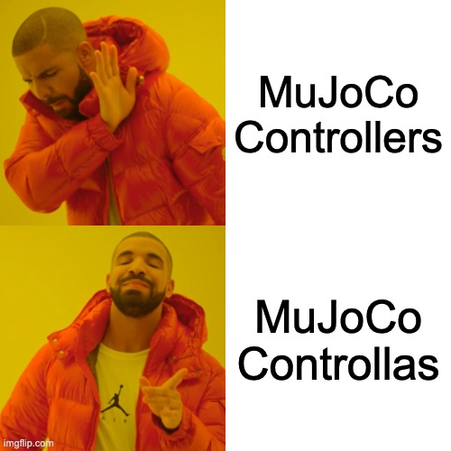

# mujoco-controllers
A repository for debugging controller implementations applied to mujoco models.

This repository is heavily inspired by [mujoco-actuators-types](https://github.com/lvjonok/mujoco-actuators-types/tree/master) and [mjctrl](https://github.com/kevinzakka/mjctrl/tree/main)

